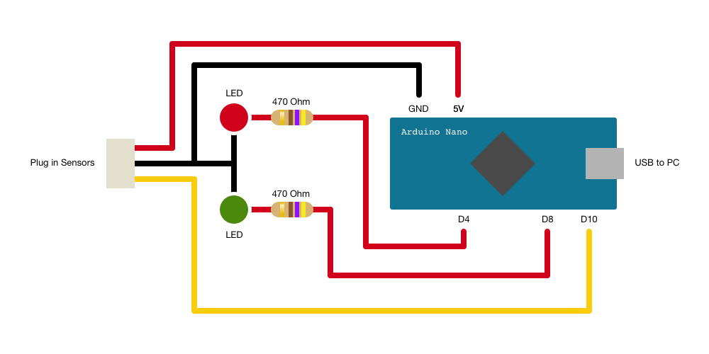
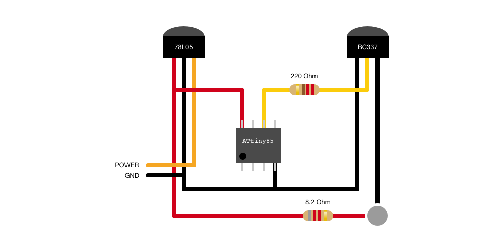

---

The RiCino Lap Counter is an [Arduino](http://arduino.cc) based, open source infrared RC Lap Counting System, compatible with the industry standard [Zround](http://www.zround.com) software. It is ideal for small scale indoor racing (Mini-Z), but could be used for any type of scale sport.

RiCino Lap Counter was originally created by [Lisergio](http://lisergio.wordpress.com/). The name RiCino is a portmanteau of _RC_ + _Arduino_ and it was coined by Lisergio. The extra "i" between the R and C was added for phonetic reasons.

## Features ##

* Arduino based Receiver with Infrared Sensors
* Unlimited number of transponders
* Works with the industry standard [Zround](http://www.zround.com) software
* Scalable to any track width
* DIY instructions
* Dirt cheap to buy parts and build on your own

---

The RiCino Lap Counter system is comprised of two main components, the Receiver and the Transponder. Each has it's own hardware and software.

### Receiver ###
The receiver can be built as a modular and expandable system, which can scale depending on the track size. The two main parts are the Decoder and the Sensors.

**Pic of Receiver**

##### Decoder #####
The main decoder is an Arduino ([ATmega328P](https://www.arduino.cc/en/Main/Products)) based module, running the custom RiCino Lap Counter software. The sensors are Infrared.

##### Sensors #####
The RiCino Lap Counter is designed with scalability in mind. You can add as many Sensors as your track requires. Usually, you'll need a senser every 70cm for a 50cm high bridge. The Sensor design is 

### Transponder ###
The transponders are based on a single ATtiny85 chip design and are programmed to emit a single HEX code.

**Pic of Transponder**

##### Transponder HEX Code Generator #####
When you programme your own transponders, it goes without saying that you should create each transponder to emit a unique code. Doing this on a local scale is easy. But we've built a tool to generate, catalogue and register every unique code used for RiCino Lap Counter. This way, no two transponders will ever be the same, no matter where you are in the world.

[Get your transponder HEX code]()

